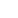
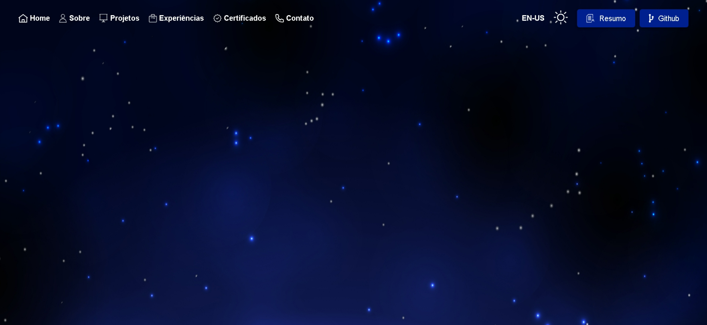
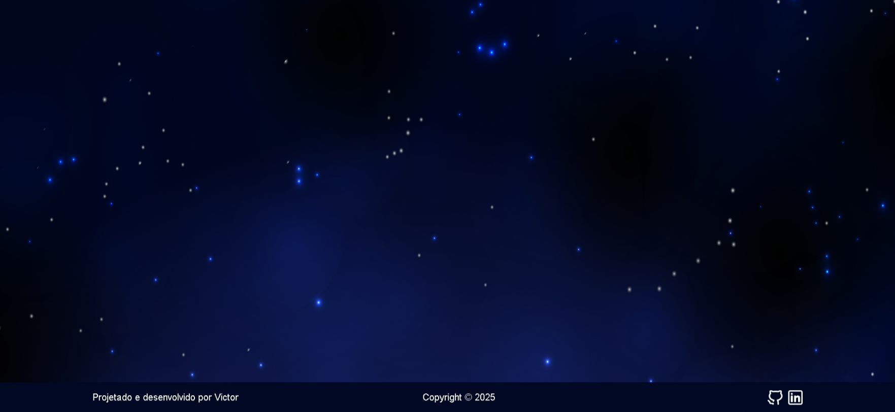
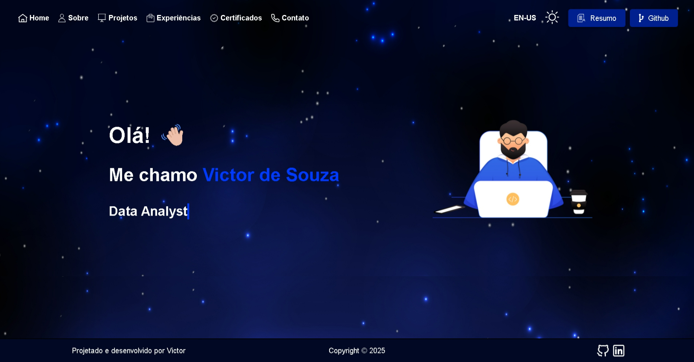
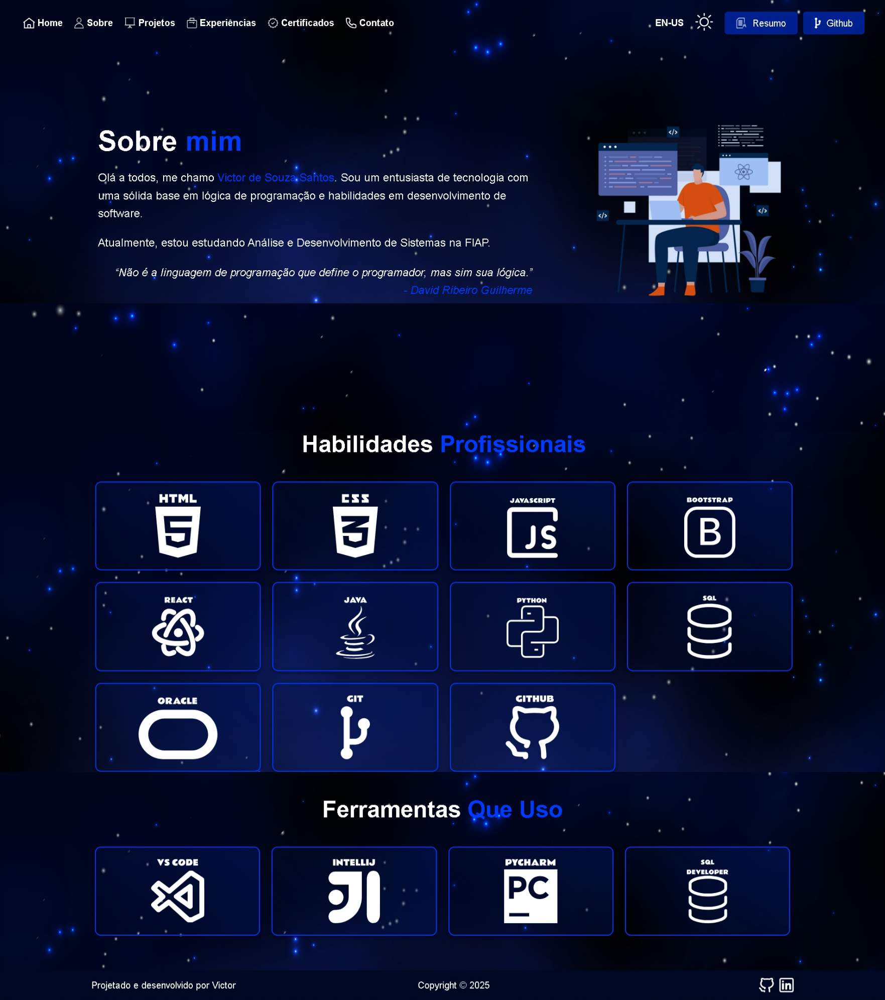
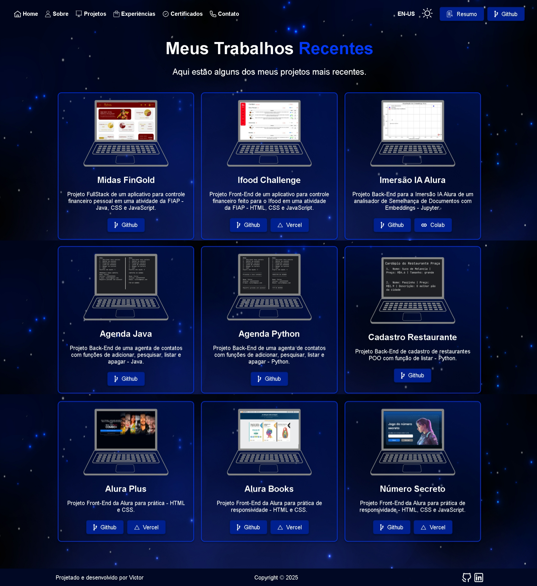
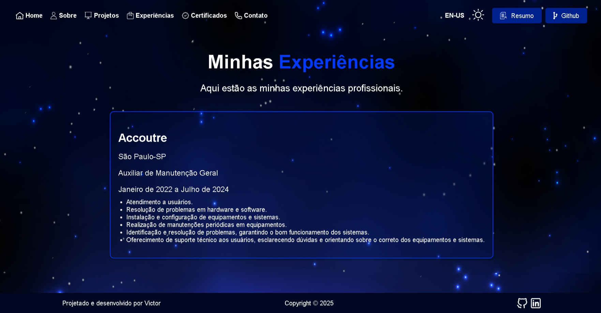
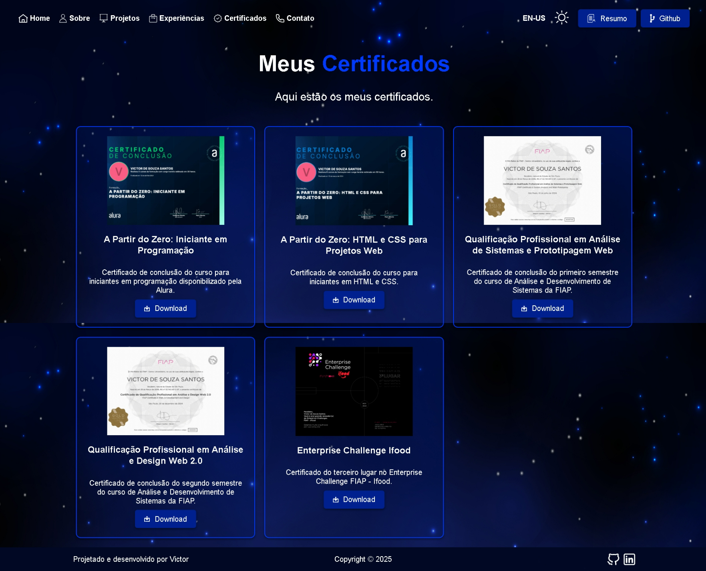

<h1 align="center">
  <a href="https://portfolio-victorsouza112.vercel.app/" target="_blank">Portfólio Web Interativo - Victor de Souza 🚀 </a>

## Sumário 
1.  **Apresentação do Portfólio **
2.  **Código Geral **
    *   2.1.  `styles.css`
    *   2.2.  `script.js`
3.  **Tela de Carregamento **
    *   3.1.  `index.html`
    *   3.2.  `loading.css`
    *   3.3.  `loading.js`
4.  **Header **
    *   4.1.  `header.html`
    *   4.2.  `header.css`
    *   4.3.  `header.js`
5.  **Footer **
    *   5.1.  `footer.html`
    *   5.2.  `footer.css`
6.  **Home **
    *   6.1.  `home.html`
    *   6.2.  `home.css`
    *   6.3.  `typing.js`
7.  **About **
    *   7.1.  `about.html`
    *   7.2.  `about.css`
8.  **Projects **
    *   8.1.  `projects.html`
    *   8.2.  `projects.css`
9.  **Experience **
    *   9.1.  `experience.html`
    *   9.2.  `experience.css`
10. **Certificates **
    *   10.1. `certificates.html`
    *   10.2. `certificates.css`
11. **Contact **
    *   11.1. `contact.html`
    *   11.2. `contact.css`

## 1. Apresentação do Portfólio 

🎉 **Bem-vindo ao meu Portfólio Web!** 🎉

Este portfólio foi cuidadosamente desenvolvido para demonstrar minhas habilidades em desenvolvimento front-end, com foco em HTML, CSS e JavaScript. Ele é mais do que uma simples coleção de projetos; é uma representação da minha paixão por tecnologia, meu comprometimento com a qualidade e minha busca contínua por aprendizado.

Navegue pelas páginas e descubra:

*   **Design Atraente:** Um design moderno e responsivo, com transições suaves e uma paleta de cores elegante, proporcionando uma experiência de usuário agradável.
*   **Interatividade:** Elementos dinâmicos e animações que trazem vida ao portfólio, demonstrando minha habilidade em JavaScript.
*   **Estrutura Clara:** Uma organização lógica do conteúdo, com seções bem definidas que facilitam a navegação e a compreensão de minhas habilidades e projetos.
*   **Multilíngua:** A funcionalidade de alternar entre os idiomas Português e Inglês, mostrando adaptabilidade e atenção aos detalhes.
*   **Responsividade:** O portfólio se adapta perfeitamente a diferentes tamanhos de tela, garantindo uma ótima experiência em desktops, tablets e smartphones.
*   **Código Organizado:** Um código limpo e bem estruturado, seguindo as melhores práticas de desenvolvimento, facilitando a leitura e a manutenção.

**Tecnologias Utilizadas:**

*   **HTML5:** Para a estrutura do conteúdo.
*   **CSS3:** Para a estilização e o design visual, incluindo animações.
*   **JavaScript:** Para a interatividade e a manipulação dinâmica do DOM.

**Objetivo:**

Este portfólio foi criado com o objetivo de mostrar minhas habilidades técnicas, minha capacidade de criar interfaces de usuário atraentes e funcionais, e minha dedicação ao desenvolvimento web. Ele é um convite para que você conheça um pouco mais sobre mim e meu trabalho.

Dê uma ⭐ caso goste do portfolio.

## 2. Código Geral 

Nesta seção, vamos explorar os arquivos que formam a base do seu portfólio: o `styles.css`, responsável pelo design e estilo, e o `script.js`, que adiciona interatividade e comportamentos dinâmicos.

### 2.1. `styles.css`

O arquivo `styles.css` é o núcleo da identidade visual do seu portfólio. Ele orquestra a aparência de cada página, utilizando uma combinação de cores, tipografia e layouts para criar uma experiência de usuário que é, ao mesmo tempo, atraente e consistente.

**Destaques do `styles.css`:**

*   **Sistema de Design:** O uso de variáveis CSS para cores e fontes permite um controle centralizado sobre o design, facilitando a manutenção e personalização do tema.
*   **Experiência Visual:** Um background com efeito de estrelas cria uma atmosfera envolvente, com transição suave quando o tema muda entre claro e escuro.
*   **Temas Adaptáveis:** A implementação de um tema claro e um tema escuro oferece uma experiência de visualização que se adapta às preferências do usuário.
*   **Componentes de Estilo:** Elementos como botões, textos em destaque e cards com gradiente são estilizados de forma reutilizável, mantendo a consistência visual em todas as páginas.
*   **Elementos Animados:** Animações sutis, como o efeito de brilho dos cards ao passar o mouse e o efeito de fade-in ao carregar a página, adicionam uma camada extra de interação e refinamento.
*   **Interface Personalizada:** A barra de rolagem estilizada reforça a identidade visual do portfólio e demonstra atenção aos detalhes.
*   **Design Responsivo:** Os estilos são adaptados para diferentes tamanhos de tela, garantindo que o layout seja perfeito em dispositivos móveis, tablets e desktops.

Essencialmente, o `styles.css` é a base da apresentação visual do seu portfólio, garantindo que cada elemento contribua para uma experiência de usuário coesa e atraente.

### 2.2. `script.js`

O arquivo `script.js` é a força motriz por trás da interatividade e da dinâmica do seu portfólio. Ele é carregado em todas as páginas, fornecendo funcionalidades essenciais como a importação de componentes reutilizáveis e a animação de elementos.

**Destaques do `script.js`:**

*   **Reutilização de Componentes:** Utiliza a função `fetch` para importar o header e o footer de seus arquivos HTML, promovendo a modularidade e a reutilização de código.
*   **Carregamento Suave:** A adição da classe `fade-in` ao body após um pequeno delay cria um efeito de carregamento suave, aprimorando a experiência do usuário.
*   **Animações ao Scrollar:** Utiliza o `IntersectionObserver` para adicionar a classe `fade-in` nos cards que aparecem ao scrollar, criando um efeito interessante ao visualizar a página.

Em resumo, o `script.js` adiciona a camada de interatividade que faz com que seu portfólio seja dinâmico, responsivo e agradável de usar.

## 3. Tela de Carregamento 

A tela de carregamento é a primeira experiência visual que o usuário tem ao acessar seu portfólio. Ela é projetada para ser atraente e informativa, enquanto o conteúdo principal é carregado. Esta seção explora os arquivos `index.html`, `loading.css` e `loading.js` que juntos criam essa experiência inicial.

### 3.1. `index.html`

O arquivo `index.html` é o ponto de partida do seu portfólio. Ele contém a estrutura básica da tela de carregamento e carrega os arquivos CSS e JavaScript necessários para a sua funcionalidade.

**Destaques do `index.html`:**

*   **Estrutura Simples:** O `index.html` é intencionalmente simples, focando em um contêiner principal (`.loading-container`) para os elementos de carregamento.
*   **Carregamento de Estilos e Scripts:** O arquivo inclui a folha de estilo `loading.css` e o script `loading.js` que são responsáveis pela aparência e comportamento da tela de carregamento.
*   **Meta Tags:** Inclui meta tags essenciais para a configuração da viewport e charset, garantindo compatibilidade com diversos dispositivos e a correta exibição de caracteres especiais.

### 3.2. `loading.css`

O arquivo `loading.css` define a aparência visual da tela de carregamento, criando uma experiência imersiva e atraente para o usuário.

**Destaques do `loading.css`:**

*   **Background Cósmico:** O fundo da tela de carregamento simula um ambiente cósmico, com estrelas e um gradiente que adicionam profundidade e interesse visual.
*   **Elementos Centrais:** Os elementos de carregamento, como o logo, a barra de progresso e o texto, são centralizados na tela para um design equilibrado e agradável.
*   **Animação do Logo:** O logo central apresenta uma animação sutil de "fade-in" e escala, que atrai o olhar do usuário.
*   **Barra de Progresso:** Uma barra de progresso animada indica visualmente o status do carregamento, utilizando cores vibrantes e um foguete que se desloca conforme o carregamento progride.
*   **Texto de Carregamento:** Um texto informativo "Loading..." com uma transição de opacidade, que é exibido quando a página começa a carregar.
*   **Transições Suaves:** Transições de opacidade são usadas para criar uma experiência de carregamento suave, que não é abrupta.

### 3.3. `loading.js`

O arquivo `loading.js` é responsável pela lógica da tela de carregamento, controlando o comportamento da barra de progresso, a animação do foguete e a transição para a próxima página.

**Destaques do `loading.js`:**

*   **Animação da Barra de Progresso:** A barra de progresso é animada para preencher toda a largura da tela, indicando o progresso do carregamento.
*   **Animação do Foguete:** Um foguete se move ao longo da barra de progresso, adicionando um elemento visual dinâmico e divertido à tela.
*   **Transição para a Próxima Página:** Uma vez que a barra de progresso é preenchida, a tela de carregamento desaparece suavemente e o usuário é redirecionado para a página principal do portfólio.
*   **Geração de Estrelas:** Utiliza JavaScript para gerar estrelas aleatórias, utilizando diversas cores e tamanhos, criando um efeito de fundo estrelado e cósmico.

## 4. Header 

O header é um componente crucial do seu portfólio, pois ele oferece a navegação principal e contém elementos importantes, como o seletor de tema e o seletor de idioma. Esta seção abordará os arquivos `header.html`, `header.css` e `header.js` que dão vida a este componente.

### 4.1. `header.html`

O arquivo `header.html` define a estrutura do cabeçalho do seu portfólio, utilizando HTML semântico para criar uma navegação clara e acessível.

**Destaques do `header.html`:**

*   **Navegação para Desktop:** A navegação para telas grandes (`header-desktop`) inclui um menu horizontal com links para as principais seções do portfólio, juntamente com um seletor de tema e idioma e botões para download do currículo e acesso ao GitHub.
*   **Navegação para Mobile:** A navegação para telas menores (`header-mobile`) inclui um seletor de tema e idioma e um botão para abrir um menu lateral (offcanvas).
*   **Offcanvas Menu:** O menu lateral (`offcanvas`) é exibido em telas pequenas e fornece os mesmos links da navegação de desktop, além dos mesmos botões para download do currículo e acesso ao GitHub, para garantir a navegação completa em qualquer dispositivo.
*   **Modal de Download:** Utiliza uma estrutura de modal para confirmar o download do currículo, oferecendo uma opção para o usuário.
*   **Links com Ícones:** Cada link do menu é acompanhado de um ícone, o que melhora a usabilidade e a identificação visual das opções.
*   **Elementos de acessibilidade:** Botões com `aria-label` para garantir a acessibilidade do site e fácil navegação com leitores de tela.

### 4.2. `header.css`

O arquivo `header.css` é responsável pela estilização do cabeçalho, garantindo que ele seja visualmente atraente e responsivo.

**Destaques do `header.css`:**

*   **Layout Flexível:** O header utiliza `display: flex` para posicionar os elementos de forma eficiente e flexível, tanto para telas grandes quanto para pequenas.
*   **Estilização da Navegação:** A navegação de desktop é estilizada com links, ícones, e um espaçamento adequado, enquanto a navegação mobile utiliza um botão para ativar o offcanvas.
*   **Seletores de Tema e Idioma:** Os seletores de tema e idioma são estilizados com uma aparência limpa e intuitiva, garantindo que sejam fáceis de usar.
*   **Estilização do Offcanvas:** O menu lateral é estilizado com transições suaves, garantindo uma experiência de usuário agradável em dispositivos móveis.
*   **Estilização do Modal:** O modal de download tem um estilo minimalista que aparece ao clicar no botão de download e some quando o usuário escolhe uma das opções.
*   **Responsividade:** O header se adapta a diferentes tamanhos de tela, com diferentes layouts para telas grandes e pequenas, utilizando `@media queries` para aplicar estilos específicos para diferentes resoluções.

### 4.3. `header.js`

O arquivo `header.js` é responsável pela lógica e interatividade do cabeçalho, incluindo o controle do tema (claro/escuro) e do idioma (português/inglês), além do funcionamento do menu lateral e do modal de download do currículo.

**Destaques do `header.js`:**

*   **Controle de Tema:** O script armazena o tema selecionado no `localStorage` e aplica o tema correspondente ao carregar a página, alternando os ícones e os estilos.
*   **Controle de Idioma:** O script armazena o idioma selecionado no `localStorage` e traduz a página ao carregar, alternando também o texto do botão de idioma.
*   **Menu Lateral:** O script ativa e desativa o menu lateral, permitindo a navegação do usuário em telas pequenas.
*   **Modal de Download:** O script controla a abertura e o fechamento do modal de download do currículo, adicionando a funcionalidade de download ao botão de download, que também varia de acordo com o idioma.
*   **Transição do Background do Header:** O script adiciona ou remove a classe `header-bg` ao header ao scrollar a página, criando um efeito interessante ao visualizar a página.
*   **Eventos de Clique:** O script utiliza eventos de clique nos botões de tema, idioma, menu lateral e download para garantir que a experiência do usuário seja responsiva.

## 5. Footer 

O footer, ou rodapé, é um componente importante do seu portfólio que, embora geralmente se encontre na parte inferior da página, tem um papel importante na identidade do site, contendo informações de contato e direitos autorais. Nesta seção, vamos detalhar os arquivos `footer.html` e `footer.css` que compõem este elemento.

### 5.1. `footer.html`

O arquivo `footer.html` define a estrutura do rodapé do seu portfólio, utilizando HTML semântico para criar um componente claro e acessível.

**Destaques do `footer.html`:**

*   **Estrutura em Três Partes:** O rodapé é dividido em três partes: à esquerda, onde é exibido o texto "Projetado e desenvolvido por Victor"; no centro, onde está o texto de copyright; e à direita, onde há links para suas redes sociais (GitHub e LinkedIn).
*   **Links com Ícones:** Os links para as redes sociais são acompanhados por ícones, o que melhora a usabilidade e a identificação visual das opções.
*   **Elementos de acessibilidade:** Ícones com `alt`, para facilitar a navegação com leitores de tela.
*   **Design Simples:** Um design limpo e simples que se integra ao design das outras páginas, com textos e ícones bem posicionados.

### 5.2. `footer.css`

O arquivo `footer.css` define a estilização do rodapé, garantindo que ele seja visualmente atraente e responsivo.

**Destaques do `footer.css`:**

*   **Layout Flexível:** Utilização de `display: flex` para posicionar os elementos do rodapé de forma eficiente e flexível.
*   **Layout Responsivo:** Utilização de `@media queries` para ajustar o layout do rodapé em telas menores, alterando para `flex-direction: column` e centralizando os elementos.
*   **Espaçamento Adequado:** O texto e os ícones são espaçados de maneira apropriada, tornando a leitura e a interação mais fáceis.
*   **Cores e Estilo:** O rodapé usa as mesmas cores do tema do portfólio, mantendo a consistência visual em todas as páginas.
*   **Transições:** Os links para as redes sociais têm uma pequena transição ao passar o mouse, criando um efeito sutil de interatividade.
*   **Alinhamento:** Os textos e ícones estão alinhados para criar uma estrutura visualmente organizada e profissional.

## 6. Home 

A página "Home" é a porta de entrada do seu portfólio e tem como objetivo apresentar você de forma clara e atraente. Esta seção abordará os arquivos `home.html`, `home.css` e `typing.js` que compõem esta página.

### 6.1. `home.html`

O arquivo `home.html` define a estrutura da página inicial do seu portfólio, utilizando HTML semântico para criar uma apresentação clara e organizada.

**Destaques do `home.html`:**

*   **Estrutura Principal:** O conteúdo é dividido em duas partes principais: uma seção com texto que apresenta você como desenvolvedor e uma seção com uma imagem de um programador.
*   **Título e Subtítulo:** A página inclui um título com uma saudação, um subtítulo com seu nome e um texto com sua profissão com efeito de digitação.
*   **Integração de Componentes:** O header e o footer são importados para garantir uma consistência visual entre as páginas.
*   **Elementos de Acessibilidade:** Utiliza elementos semânticos e o texto com efeito de digitação utiliza o `span` para garantir que a página seja acessível.
*   **Links de Navegação:** Links que direcionam para outras páginas do portfólio através do header.
*   **Carregamento de Estilos e Scripts:** Inclui a folha de estilo `home.css` e o script `typing.js` que são responsáveis pela aparência e comportamento da página home.

### 6.2. `home.css`

O arquivo `home.css` define a estilização da página inicial, garantindo que ela seja visualmente atraente e responsiva.

**Destaques do `home.css`:**

*   **Layout Flexível:** O conteúdo é posicionado com `display: flex` e alinhado com `justify-content: center` e `align-items: center`, criando um layout responsivo e dinâmico.
*   **Estilo do Texto:** O título, subtítulo e a profissão são estilizados com fontes apropriadas e com um efeito de digitação na profissão, criando uma hierarquia visual clara e marcante.
*   **Animação do Wave:** O emoji de aceno tem uma animação de onda suave, adicionando um detalhe de interação.
*   **Imagem de Programador:** A imagem de programador é ajustada para se encaixar perfeitamente no layout, com responsividade para diferentes tamanhos de tela.
*   **Responsividade:** Utiliza `@media queries` para ajustar o layout em telas menores, alterando o `flex-direction` para `column` para melhor adequação em dispositivos móveis.
*   **Animação de Digitação:** A animação de digitação utiliza keyframes para simular um texto sendo digitado, criando um efeito visual interessante.

### 6.3. `typing.js`

O arquivo `typing.js` é responsável pela lógica de animação do texto da profissão na página inicial, simulando um efeito de digitação.

**Destaques do `typing.js`:**

*   **Efeito de Digitação:** O script cria um efeito de digitação com um cursor piscando, adicionando um toque interativo à página.
*   **Array de Textos:** O script utiliza um array de textos, que permite alternar a profissão exibida, criando uma sensação de dinamismo.
*   **Controle de Velocidade:** O script controla a velocidade da digitação e o delay para os próximos textos e exclusão, criando uma animação suave e equilibrada.

## 7. About 

A página "About" é o espaço onde você compartilha mais sobre sua história, habilidades e as ferramentas que você utiliza no seu trabalho como desenvolvedor. Esta seção abordará os arquivos `about.html` e `about.css` que dão forma a esta página.

### 7.1. `about.html`

O arquivo `about.html` define a estrutura da página "Sobre mim", utilizando HTML semântico para organizar as informações de forma clara e acessível.

**Destaques do `about.html`:**

*   **Estrutura da Página:** O conteúdo é dividido em três partes principais: uma seção com texto sobre você, uma seção com habilidades e outra com ferramentas utilizadas.
*   **Apresentação Pessoal:** A seção de texto contém uma breve apresentação, incluindo sua paixão por tecnologia, sua formação e uma citação motivacional.
*   **Habilidades:** A seção de habilidades inclui ícones que representam cada uma de suas habilidades, com links para sites de referencia.
*   **Ferramentas:** A seção de ferramentas inclui ícones que representam as ferramentas que você utiliza no desenvolvimento, com links para os respectivos sites.
*   **Integração de Componentes:** O header e o footer são importados para garantir a consistência visual com as outras páginas.
*   **Elementos de Acessibilidade:** Utiliza elementos semânticos para garantir que a página seja acessível para todos os usuários.
*   **Carregamento de Estilos e Scripts:** Carrega a folha de estilo `about.css` e o script `script.js`, para estilizar e usar as funcionalidades base do site.

### 7.2. `about.css`

O arquivo `about.css` define a estilização da página "Sobre mim", garantindo que ela seja visualmente atraente e responsiva.

**Destaques do `about.css`:**

*   **Layout Flexível:** A página utiliza `display: flex` para organizar as informações em um layout responsivo e dinâmico, onde a tela é dividida em uma seção de texto e uma de imagem.
*   **Estilo do Texto:** O texto é estilizado para ser legível e agradável, com destaque para o título e a citação.
*   **Grid de Habilidades e Ferramentas:** Utiliza `display: grid` para posicionar os ícones de habilidades e ferramentas de forma organizada e responsiva, ajustando o número de colunas com `@media queries` para diferentes tamanhos de tela.
*   **Responsividade:** O layout se adapta a diferentes tamanhos de tela, com o ajuste das seções e da quantidade de colunas no grid de habilidades e ferramentas.
*   **Efeito de Gradiente:** Os cards com os ícones utilizam o efeito de gradiente ao passar o mouse, criando um detalhe visual interessante.

## 8. Projects 

A página "Projects" é onde você apresenta seus trabalhos mais recentes, destacando suas habilidades e a diversidade de seus projetos. Esta seção abordará os arquivos `projects.html` e `projects.css` que dão vida a esta página.

### 8.1. `projects.html`

O arquivo `projects.html` define a estrutura da página "Projetos", utilizando HTML semântico para organizar as informações de forma clara e acessível.

**Destaques do `projects.html`:**

*   **Estrutura da Página:** O conteúdo é dividido em duas partes principais: uma seção de texto que introduz os projetos e uma seção com os projetos em si.
*   **Título e Introdução:** A página inclui um título que apresenta seus trabalhos mais recentes e um parágrafo de introdução.
*   **Grid de Projetos:** Os projetos são apresentados em um grid, cada um com um título, uma descrição, uma imagem e botões para acessar o código no GitHub e a demonstração na Vercel (quando aplicável).
*   **Integração de Componentes:** O header e o footer são importados para garantir uma consistência visual entre as páginas.
*   **Elementos de Acessibilidade:** Utiliza elementos semânticos para garantir que a página seja acessível a todos os usuários.
*   **Carregamento de Estilos e Scripts:** Carrega a folha de estilo `projects.css` e o script `script.js`, para estilizar e usar as funcionalidades base do site.

### 8.2. `projects.css`

O arquivo `projects.css` define a estilização da página "Projetos", garantindo que ela seja visualmente atraente e responsiva.

**Destaques do `projects.css`:**

*   **Layout Flexível:** A página utiliza `display: flex` para organizar as informações em um layout responsivo e dinâmico.
*   **Estilo do Texto:** O texto é estilizado para ser legível e agradável, com destaque para os títulos e descrições dos projetos.
*   **Grid de Projetos:** Utiliza `display: grid` para posicionar os projetos de forma organizada e responsiva, ajustando o número de colunas com `@media queries` para diferentes tamanhos de tela.
*   **Responsividade:** O layout se adapta a diferentes tamanhos de tela, com o ajuste das colunas no grid de projetos.
*   **Efeito de Gradiente:** Os cards dos projetos utilizam o efeito de gradiente ao passar o mouse, criando um detalhe visual interessante.
*   **Botões:** Os botões dos projetos são estilizados de forma clara e intuitiva, com transição ao passar o mouse, direcionando para o link do Github ou da Vercel.

## 9. Experience 

A página "Experience" é onde você compartilha suas experiências profissionais, destacando as empresas em que trabalhou e as responsabilidades que desempenhou. Esta seção abordará os arquivos `experience.html` e `experience.css` que dão vida a esta página.

### 9.1. `experience.html`

O arquivo `experience.html` define a estrutura da página "Experiência", utilizando HTML semântico para organizar as informações de forma clara e acessível.

**Destaques do `experience.html`:**

*   **Estrutura da Página:** O conteúdo é dividido em duas partes principais: uma seção de texto que introduz as experiências e uma seção que detalha suas experiências.
*   **Título e Introdução:** A página inclui um título que apresenta suas experiências profissionais e um parágrafo de introdução.
*   **Detalhes da Experiência:** A seção com os detalhes da experiência inclui um título com o nome da empresa, a localização, o cargo, o período trabalhado e uma lista com suas atividades.
*   **Integração de Componentes:** O header e o footer são importados para garantir uma consistência visual entre as páginas.
*   **Elementos de Acessibilidade:** Utiliza elementos semânticos para garantir que a página seja acessível para todos os usuários.
*   **Carregamento de Estilos e Scripts:** Carrega a folha de estilo `experience.css` e o script `script.js`, para estilizar e usar as funcionalidades base do site.

### 9.2. `experience.css`

O arquivo `experience.css` define a estilização da página "Experiência", garantindo que ela seja visualmente atraente e responsiva.

**Destaques do `experience.css`:**

*   **Layout Flexível:** A página utiliza `display: flex` para organizar as informações em um layout responsivo e dinâmico.
*   **Estilo do Texto:** O texto é estilizado para ser legível e agradável, com destaque para os títulos e descrições das experiências.
*   **Detalhes da Experiência:** Utiliza listas para apresentar suas atividades de forma organizada.
*   **Responsividade:** O layout se adapta a diferentes tamanhos de tela, com o ajuste das seções de acordo com a resolução.
*   **Efeito de Gradiente:** O card da experiência utiliza o efeito de gradiente ao passar o mouse, criando um detalhe visual interessante.

## 10. Certificates 

A página "Certificates" é onde você apresenta seus certificados, destacando suas conquistas e seu compromisso com o aprendizado contínuo. Esta seção abordará os arquivos `certificates.html` e `certificates.css` que dão forma a esta página.

### 10.1. `certificates.html`

O arquivo `certificates.html` define a estrutura da página "Certificados", utilizando HTML semântico para organizar as informações de forma clara e acessível.

**Destaques do `certificates.html`:**

*   **Estrutura da Página:** O conteúdo é dividido em duas partes principais: uma seção de texto que introduz os certificados e uma seção com os certificados em si.
*   **Título e Introdução:** A página inclui um título que apresenta seus certificados e um parágrafo de introdução.
*   **Grid de Certificados:** Os certificados são apresentados em um grid, cada um com uma imagem do certificado, um título, uma descrição e um botão para fazer o download do certificado.
*   **Integração de Componentes:** O header e o footer são importados para garantir uma consistência visual entre as páginas.
*   **Elementos de Acessibilidade:** Utiliza elementos semânticos para garantir que a página seja acessível para todos os usuários.
*   **Carregamento de Estilos e Scripts:** Carrega a folha de estilo `certificates.css` e o script `script.js`, para estilizar e usar as funcionalidades base do site.

### 10.2. `certificates.css`

O arquivo `certificates.css` define a estilização da página "Certificados", garantindo que ela seja visualmente atraente e responsiva.

**Destaques do `certificates.css`:**

*   **Layout Flexível:** A página utiliza `display: flex` para organizar as informações em um layout responsivo e dinâmico.
*   **Estilo do Texto:** O texto é estilizado para ser legível e agradável, com destaque para os títulos e descrições dos certificados.
*   **Grid de Certificados:** Utiliza `display: grid` para posicionar os certificados de forma organizada e responsiva, ajustando o número de colunas com `@media queries` para diferentes tamanhos de tela.
*   **Responsividade:** O layout se adapta a diferentes tamanhos de tela, com o ajuste das colunas no grid de certificados.
*   **Efeito de Gradiente:** Os cards dos certificados utilizam o efeito de gradiente ao passar o mouse, criando um detalhe visual interessante.
*   **Botões:** Os botões dos certificados são estilizados de forma clara e intuitiva, direcionando para o download dos respectivos certificados.

## 11. Contact 

A página "Contact" é onde você disponibiliza suas informações de contato, facilitando que as pessoas se conectem com você através de seus canais de comunicação preferidos. Esta seção abordará os arquivos `contact.html` e `contact.css` que dão vida a esta página.

### 11.1. `contact.html`

O arquivo `contact.html` define a estrutura da página "Contato", utilizando HTML semântico para organizar as informações de forma clara e acessível.

**Destaques do `contact.html`:**

*   **Estrutura da Página:** O conteúdo é dividido em duas partes principais: uma seção de texto que introduz as informações de contato e uma seção com os links de contato.
*   **Título e Introdução:** A página inclui um título que convida o usuário a entrar em contato e um parágrafo de introdução.
*   **Links de Contato:** Os links de contato incluem seus perfis no GitHub, LinkedIn, um link para enviar um e-mail e um link para o WhatsApp.
*   **Integração de Componentes:** O header e o footer são importados para garantir uma consistência visual entre as páginas.
*   **Elementos de Acessibilidade:** Utiliza elementos semânticos para garantir que a página seja acessível para todos os usuários.
*   **Carregamento de Estilos e Scripts:** Carrega a folha de estilo `contact.css` e o script `script.js`, para estilizar e usar as funcionalidades base do site.

### 11.2. `contact.css`

O arquivo `contact.css` define a estilização da página "Contato", garantindo que ela seja visualmente atraente e responsiva.

**Destaques do `contact.css`:**

*   **Layout Flexível:** A página utiliza `display: flex` para organizar as informações em um layout responsivo e dinâmico.
*   **Estilo do Texto:** O texto é estilizado para ser legível e agradável, com destaque para o título e introdução.
*   **Links de Contato:** Os links de contato são apresentados em um grid, com ícones e nomes dos canais, facilitando a identificação.
*   **Responsividade:** O layout se adapta a diferentes tamanhos de tela, com o ajuste do grid dos links de contato.
*   **Transição:** Os links de contato têm uma transição suave ao passar o mouse, criando um efeito de interatividade.